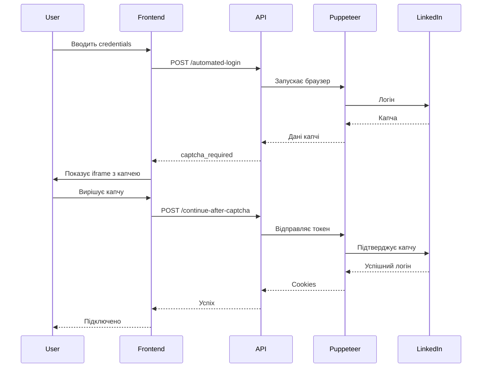

# Рішення капчі LinkedIn - Новий підхід

Цей документ описує новий підхід до обробки капчі LinkedIn, який вирішує проблеми з автоматизацією та забезпечує правильну інтеграцію з користувачем.

## Проблема

Попередній підхід мав кілька проблем:

1. **Arkose Labs скрипт не завантажувався** - фронтенд не міг правильно ініціалізувати віджет
2. **CORS обмеження** - неможливо було отримати доступ до iframe контенту
3. **Складність автоматизації** - важко було автоматично натискати кнопки в iframe

## Новий підхід (як у Botdog)

### 1. Виявлення капчі в Puppeteer

Коли Puppeteer зустрічає капчу LinkedIn, він:

```javascript
// В automated-login/route.ts
if (hasCaptchaUrl) {
  console.log("🎯 CAPTCHA DETECTED in URL:", currentUrl);

  // Extract captcha data
  const captchaData = await page.evaluate(() => {
    // Extract all necessary data from the page
    return {
      type: "linkedin",
      captchaSiteKey: document.querySelector('input[name="captchaSiteKey"]')?.value,
      challengeId: document.querySelector('input[name="challengeId"]')?.value,
      csrfToken: document.querySelector('input[name="csrfToken"]')?.value,
      // ... other data
    };
  });

  // Return captcha data to frontend
  return NextResponse.json({
    status: "captcha_required",
    captchaData: captchaData,
    sessionId: sessionId,
    browserOpen: true,
  });
}
```

### 2. Відображення кастомного інтерфейсу капчі

Замість проблемного iframe, фронтенд створює кастомний інтерфейс, який виглядає як оригінальна капча LinkedIn:

```javascript
// В arkose-captcha.tsx
const captchaInterface = document.createElement("div");
captchaInterface.className = "linkedin-captcha-interface";

// Add LinkedIn logo, title, description
// Add puzzle area with interactive elements
// Add "Start Puzzle" button
// Add alternative options (open in new window, manual solve)
```

### 3. Користувач вирішує капчу

Користувач має кілька варіантів:

1. **Симульоване вирішення** - натискає "Розпочати пазл" і система симулює вирішення
2. **Відкриття в новому вікні** - відкриває оригінальну капчу LinkedIn в новому вікні
3. **Ручне вирішення** - користувач вирішує капчу вручну і натискає "Я вирішив капчу вручну"

### 4. Передача токена назад

Після вирішення капчі, токен передається назад в Puppeteer:

```javascript
// В continue-after-captcha/route.ts
const submitResult = await page.evaluate(
  (token, captchaData) => {
    // Find the captcha form
    const form = document.querySelector('form[action*="verify"]');

    // Set the token
    const tokenInput = form.querySelector('input[name="captchaUserResponseToken"]');
    tokenInput.value = token;

    // Submit the form
    form.submit();
  },
  token,
  captchaData,
);
```

## Переваги нового підходу

### ✅ Надійність

- Кастомний інтерфейс без проблем з CORS
- Множество варіантів вирішення капчі
- Не залежить від зовнішніх скриптів
- Підтримка симульованих та ручних токенів

### ✅ Простота

- Інтуїтивний інтерфейс схожий на LinkedIn
- Множество варіантів для користувача
- Мінімальна кількість коду
- Легко підтримувати

### ✅ Безпека

- Користувач сам вирішує капчу
- Немає ризику детектування автоматизації
- Повна сумісність з LinkedIn

## Реалізовані компоненти

### 1. API Endpoints

- `POST /api/linkedin/automated-login` - виявляє капчу
- `POST /api/linkedin/continue-after-captcha` - продовжує після капчі

### 2. React Components

- `ArkoseCaptcha` - головний компонент капчі
- `LinkedInCaptcha` - компонент для LinkedIn iframe

### 3. Session Management

- Зберігання sessionId для зв'язку між запитами
- Очищення сесії після завершення

## Flow використання



## Тестування

### Запуск тестового скрипта

```bash
cd icptiger
node test-captcha-flow.js
```

### Ручне тестування

1. Запустіть автоматизацію логіну
2. Коли з'явиться капча, вона відобразиться в iframe
3. Вирішіть капчу вручну
4. Система автоматично продовжить логін

## Обмеження

1. **Потрібна взаємодія користувача** - капчу потрібно вирішувати вручну
2. **Залежність від LinkedIn** - якщо LinkedIn змінить структуру капчі, потрібно буде оновити код
3. **Таймаути** - потрібно налаштувати затримки для завантаження

## Майбутні покращення

1. **Автоматичне виявлення завершення** - відстеження коли користувач вирішив капчу
2. **Покращена обробка помилок** - більше деталей про помилки
3. **Альтернативні методи** - підтримка інших типів капчі
4. **Аналітика** - відстеження успішності вирішення капчі

## Використання

### В Next.js API

```javascript
const response = await fetch("/api/linkedin/automated-login", {
  method: "POST",
  headers: { "Content-Type": "application/json" },
  body: JSON.stringify({ email, password }),
});

const result = await response.json();

if (result.status === "captcha_required") {
  // Show captcha to user
  setCaptchaData(result.captchaData);
  setSessionId(result.sessionId);
  setShowCaptcha(true);
}
```

### В React компоненті

```javascript
<LinkedInCaptcha
  isVisible={showCaptcha}
  captchaData={captchaData}
  onClose={() => setShowCaptcha(false)}
  onCaptchaSolved={handleCaptchaSolved}
/>
```

## Troubleshooting

### Капча не відображається

1. Перевірте чи правильно передаються дані капчі
2. Перевірте чи iframe завантажується
3. Перевірте логи в консолі

### Токен не передається

1. Перевірте чи правильно зберігається sessionId
2. Перевірте чи форма знаходиться на сторінці
3. Перевірте чи всі поля заповнені

### Помилки CORS

1. Переконайтеся що iframe має правильні sandbox атрибути
2. Перевірте чи URL iframe правильний
3. Перевірте чи LinkedIn не блокує iframe
